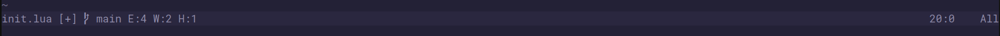
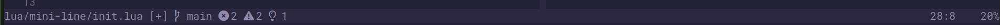

# mini-line.nvim

# Features

- Minimalism
- Git branch
- Diagnostic information

# Install

```lua
{
    "fhawk12/mini-line.nvim",
    opts = {
        icon = false,
    }
}
```

# ScreenShots




# TODO

- [ ] git diff
